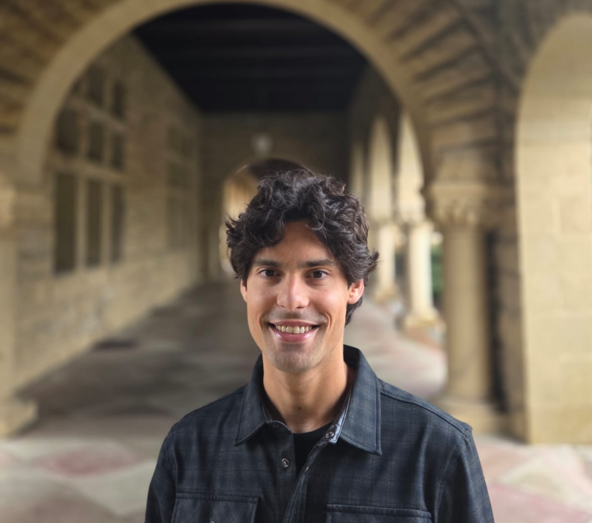



::::: {.home-header}
::: {.home-photo}
{.profile-pic fig-alt="João M. Souto-Maior"}
:::

:::: {.home-intro}
::: {.home-name}
João M. Souto-Maior
:::
::: {.home-role}
Economist at The Burning Glass Institute
:::
::: {.home-research}
Research on learning opportunities, the changing labor market, and economic mobility.
:::
::::
:::::

::: {.home-buttons}
[<i class="bi bi-file-earmark-pdf"></i> CV](files/Souto-Maior_cv.pdf){.btn-link .btn-fill}
[<i class="bi bi-linkedin"></i> LinkedIn](https://www.linkedin.com/in/jo%C3%A3o-souto-maior-70439b15a/){.btn-link}
[<i class="bi bi-github"></i> GitHub](https://github.com/joaosoutomaior/){.btn-link}
[<i class="bi bi-mortarboard-fill"></i> Google Scholar](https://scholar.google.com/citations?user=z231epEAAAAJ&hl=pt-BR&oi=ao){.btn-link}
:::
