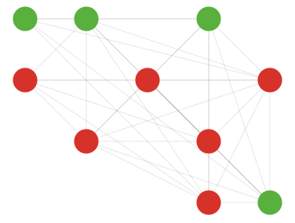
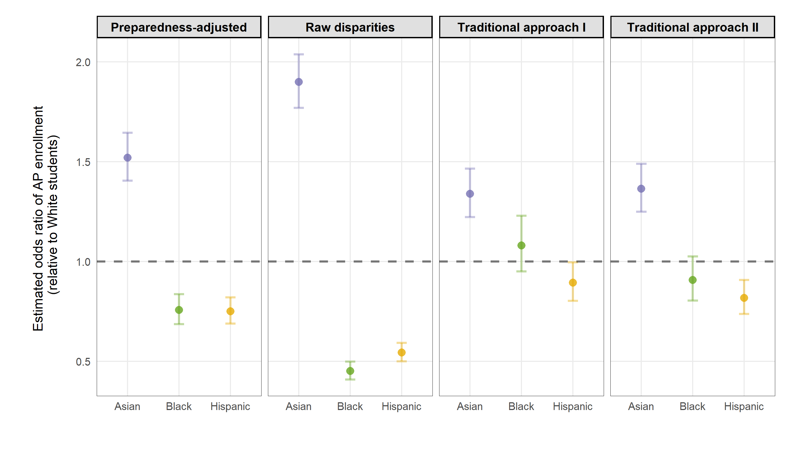
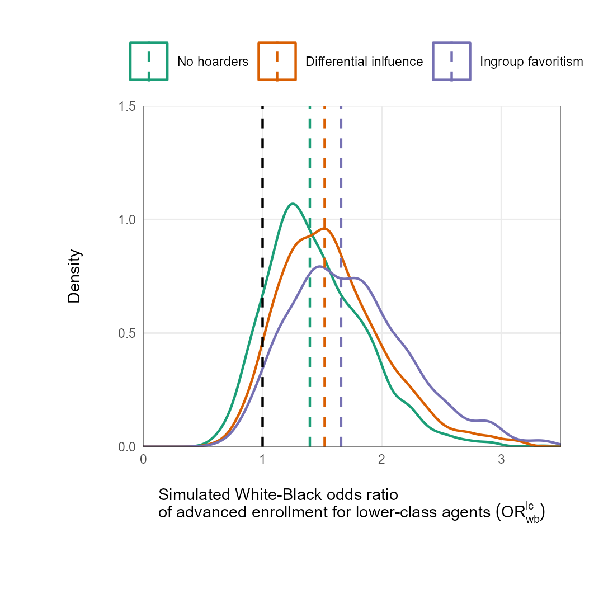

<link rel="stylesheet" href="https://use.fontawesome.com/releases/v6.4.0/css/all.css" integrity="sha384-hWVjflwFxL6sNzntih27bfxkr27PmbbK/iSvJ+a4+0owXq79v+lsFkW54bOGbiDQ" crossorigin="anonymous">
  
  

About
=====================================

Column {data-width=300}
-------------------------------------

###

  

<p1> 
Joao M. Souto-Maior
</p1> 
<p2> 
 
Postdoctoral associate
 
New York University
 
<a href="files/JSM_cv.pdf" target="_blank" class = "a2" >CV</a>
<a href="https://github.com/joaosoutomaior/" target="_blank" class = "a2" ><i class="fa-brands fa-github"></i></a>
<a href="https://scholar.google.com/citations?user=z231epEAAAAJ&hl=pt-BR&oi=ao" target="_blank" class = "a2"><i class="fa-solid fa-graduation-cap"></i></a>

Column {data-width=700}
-------------------------------------

###

Welcome to my website!

I am a postdoctoral associate (effective in August, 2023) in the [Institute of Human Development and Social Change](https://steinhardt.nyu.edu/ihdsc) at the New York University. I am on the 2023-24 job market.

In my research, I rely on innovative methodological approaches---such as qualitatively informed agent-based models and machine learning techniques---to re-examine “old” questions in education
research. Doing so, I hope to improve the quality of evidence on questions of great
relevance to education policy and practice. In particular, I concentrate on questions related to the organizational decisions of educational institutions and how they impact unequal educational opportunities across race and class lines. 

In my dissertation (advised by L'Heureux Lewis-McCoy and with support from [NYU's agent-based modeling lab](https://publichealth.nyu.edu/research-scholarship/centers-labs-initiatives/agent-based-modeling-lab)), I designed qualitatively-informed agent-based models to address questions concerning the emergence of educational inequalities---defined as access to advanced coursework---between Black and White students who attend the same school. I investigated the role of racial composition on Black students' educational opportunities and explored how educational opportunities are hoarded within schools. 

As a postdoctoral researcher, I work with Rachel Fish (NYU) and Kenneth Shores (University of Delaware) investigating methodological issues concerning the existing quantitative evidence on the disproportionate representation of Black students in special education programs.

Please navigate across the pages to learn about my research; teaching; and to access selected resources.

###

<p1>Areas of Research</p1>

&emsp; <i class="fa-solid fa-book" style="font-size: 8pt"></i> Organizations
 
&emsp; <i class="fa-solid fa-book" style="font-size: 8pt"></i> Education policy
 
&emsp; <i class="fa-solid fa-book" style="font-size: 8pt"></i> Racial inequality
 
&emsp; <i class="fa-solid fa-book" style="font-size: 8pt"></i> Computational methods

###

<p1>Education</p1>

&emsp; <i class="fa-solid fa-graduation-cap" style="font-size: 8pt"></i> Ph.D. Sociology of Education, New York University. 2023.
 
&emsp; <i class="fa-solid fa-graduation-cap" style="font-size: 8pt"></i> M.Phil. Sociology of Education, New York University. 2021.
 
&emsp; <i class="fa-solid fa-graduation-cap" style="font-size: 8pt"></i> B.A. Economics with mathematical emphasis, University of Wisconsin-Madison. 2017.

### 

<p1>Note</p1>

&emsp; <i class="fa-solid fa-note-sticky" style="font-size: 8pt"></i> For research/publication purposes, I hyphenate my last name: Souto-Maior.

Research 
=====================================

###

<p1>Research agenda</p1>

In my research, I rely on innovative methodological approaches to re-examining “old” questions in education research. Doing so, I hope to improve the quality of evidence on some of the key questions to education policy and practice. In particular, I concentrate on questions related to the organization of educational institutions, looking at how organizational decisions impact the formation of racial and socioeconomic inequalities in education opportunity. This work is defined by two main areas of research, detailed below.

<titleboxsmall>
<p3><i class="fa-solid fa-circle" style="color:orange; font-size: 9pt"></i> Bringing insights from complex systems to school organization research</p3>
 
<left>
<button onclick="readMore1('1000')" class="button" style="float: left">more</button>
</left>
</titleboxsmall>
 

<moredetails>
 
Understanding the organizational behavior of schools has long been a challenging task since school’s internal dynamics are shaped by the decisions of and social interactions between multiple actors, such as students, families, administrators and school staff. Because of this dependence on the social dynamics which emerge from interdependent individual action, one of my research focuses is to apply insights from complex systems approaches in innovative and creative ways to address important questions within school organization research.
</moredetails>

<titleboxsmall>
<p3><i class="fa-solid fa-circle" style="color:green; font-size: 9pt"></i> Rethinking the analysis of bias in student sorting processes</p3>
 
<left>
<button onclick="readMore1('1001')" class="button" style="float: left">more</button>
</left>
</titleboxsmall>
 

<moredetails>
 
Among the central decisions which educational institutions have to make is the one of sorting students. Schools, for example, often need to decide which students are allowed to: pass courses; advance to subsequent grades; take advanced courses. Similarly, selective institutions (such as selective high schools and selective colleges/universities) need to sort students when making admissions decisions, sorting the pool of applicants into those who are offered admission and those who are not. One of my research focuses is to improve current methodological strategies to examine the possible existence of biases in these sorting processes.
</moredetails>

###

<p1> Papers under review </p1>

<titlebox>
<p3>The presence of White students and the emergence of Black-White within-school inequalities: two interaction-based mechanisms.</p3>
 
<me>Joao Souto-Maior</me> (2023). *arXiv preprint*.
 
<left>
<button onclick="readMore1('1')" class="button" style="float: left">more</button>
<a href="https://arxiv.org/pdf/2304.04849.pdf" target="_blank" class = "a2">pdf</a>
<i class="fa-solid fa-circle" style="color:orange; font-size: 9pt"></i>
</left>
</titlebox>
 

<moredetails>
 
**Abstract:** This article investigates mechanism-based explanations for a well-known empirical pattern in sociology of education, namely, that Black-White unequal access to school resources -- defined as advanced coursework -- is the highest in racially diverse and majority-White schools. Through an empirically calibrated and validated agent-based model, this study explores the dynamics of two qualitatively informed mechanisms, showing (1) that we have reason to believe that the presence of White students in school can influence the emergence of Black-White advanced enrollment disparities and (2) that such influence can represent another possible explanation for the macro-level pattern of interest. Results contribute to current scholarly accounts of within-school inequalities, shedding light into policy strategies to improve the educational experiences of Black students in racially integrated settings.
</moredetails>

<titlebox>
<p3>Adjusting for academic preparedness when estimating enrollment disparities in advanced high school coursework</p3>
 
<me>Joao Souto-Maior</me> & Ravi Shroff (2022). *arXiv preprint*.
 
<left>
<button onclick="readMore1('2')" class="button" style="float: left">more</button>
<a href="https://arxiv.org/pdf/2306.15075.pdf" target="_blank" class = "a2">pdf</a>
<i class="fa-solid fa-circle" style="color:green; font-size: 9pt"></i>
</left>
</titlebox>
 

<moredetails>
**Abstract:** Whether racial disparities in enrollment in advanced high school coursework can be attributed to differences in prior academic preparation is a central empirical question in sociological research,  with important implications for education policy. 
However, the regression-based approaches to this question that are predominant in the literature suffer significant methodological limitations by implicitly assuming that students are similarly prepared if and only if they have similar values on a selected set of academic background measures.
Here, we provide a general technique to estimate enrollment disparities in advanced coursework between similarly-prepared students of different races that is less vulnerable to these limitations. 
We introduce a novel measure of academic preparedness, a student's *ex-ante* probability of success in the course, directly adjust for this single measure in a regression model of enrollment on race, and assess the robustness of estimated disparities to potential unmeasured confounding. 
We illustrate this approach by analyzing Black-White disparities in AP mathematics enrollment in a large, urban, public school system in the United States.
We find that preexisting differences in academic preparation do not fully explain the under-representation of Black students relative to White students in AP mathematics, and contrast our results with those from traditional approaches.
</moredetails>

<titlebox>
<p3>Hoarding without hoarders: unpacking the emergence of opportunity hoarding within schools</p3>
 
<me>Joao Souto-Maior</me> (2023). *arXiv preprint*.
 
<left>
<button onclick="readMore1('3')" class="button" style="float: left">more</button>
<a href="https://arxiv.org/pdf/2305.14653.pdf" target="_blank" class = "a2">pdf</a>
<i class="fa-solid fa-circle" style="color:orange; font-size: 9pt"></i>
</left>
</titlebox>
  

<moredetails>
**Abstract:** Sociologists of education increasingly highlight the role of opportunity hoarding in the formation of Black-White educational inequalities. Informed by this literature, this article unpacks the necessary and sufficient conditions under which the hoarding of educational resources emerges within schools. It develops a qualitatively informed agent-based model which captures Black and White students' competition for a valuable school resource: advanced coursework. In contrast to traditional accounts -- which explain the emergence of hoarding through the actions of Whites that keep valuable resources within White communities -- simulations, perhaps surprisingly, show hoarding to arise even when Whites do not play the role of hoarders of resources. Behind this result is the fact that a structural inequality (i.e., racial differences in social class) -- and not action-driven hoarding -- is the necessary condition for hoarding to emerge. Findings, therefore, illustrate that common action-driven understandings of opportunity hoarding can overlook the structural foundations behind this important phenomenon. Policy implications are discussed.
</moredetails>

###

<p1> Papers in progress </p1>

<titlebox>
<p3>The salience of mechanisms shaping within-school racial inequalities across school- and district-level characteristics</p3>
 
<me>Joao Souto-Maior.</me>
 
<left>
<button onclick="readMore5('1')" class="button" style="float: left">more</button>
<i class="fa-solid fa-circle" style="color:orange; font-size: 9pt"></i>
</left>
</titlebox>
  

<moredetails>
I explore the school- and district-level characteristics under which the agent-based model constructed in "Black-White advanced enrollment inequalities and the share of White students in school: an agent-based modeling investigation" performs best, providing insights on circumstances under which the inequality-producing mechanisms considered in the model tend to be more salient.
</moredetails>

<titlebox>
<p3>Determinants of race- and class-based educational inequalities within Brazilian high schools</p3>
 
<me>Joao Souto-Maior.</me>
 
<left>
<button onclick="readMore5('2')" class="button" style="float: left">more</button>
</left>
</titlebox>
  

<moredetails>
This paper aims at filling the gap of descriptive investigations of within-school educational inequalities in Brazil. Using publicly-available data from national high school exams, I rely on multilevel-models of student performance with school- and race-specific random effects to highlight the school-level factors correlated with within-school inequalities. An ultimate goal of the project is to allow its academic findings to be accessible to the general public---journalists, policymakers and those who wish to invest in better conditions for learning in Brazilian schools. A final product of this work is the publishing of an accessible and interactive dashboard application, which maps race- and class-based within-school inequalities across Brazilian schools, allowing users to gain both a broad and school-specific view of the study's results.
</moredetails>

<titlebox>
<p3>Stepping out of the closet and into engagement: a quantitative analysis of outness, GSA engagement, and classroom engagement</p3>
 
Hank Sherwood, <me>Joao Souto-Maior</me>, Paul Poteat, Hirokazu Yoshikawa, Jerel Calzo.
 
<left>
<button onclick="readMore5('3')" class="button" style="float: left">more</button> <a href="https://github.com/joaosoutomaior/outness-engagement-GSAs-code" class = "a2" >code</a>
</left>
</titlebox>
 

<moredetails>
Using survey data from Massachusetts, New York paper, and San Diego schools, the project examines the role of gender and sexual outness on student classroom engagement. As a second author, my primary contribution to this project consists of providing a methodological assistance and of developing the code for the data analysis.
</moredetails>

Teaching
=====================================

Column 
-------------------------------------

### 

<p1>Laboratory instructor</p1>

<titlebox>
<p3>Undergraduate basic statistics</p3>
 
New York University --- from Spring 2019 to Spring 2021
 
<left>
<button onclick="readMore2('6')" class="button" style="float: left" style="float: right">more</button> <a href="https://bookdown.org/joao_msoutomaior/intro-stats-notes" target="_blank" class="a2">notes</a> <a href="files/syllabus_Basic-Stats_Spring2021.pdf" target="_blank" class="a2">syllabus S-21</a> 
</left>
</titlebox>
 

<moredetails>
This introductory course is designed to prepare undergraduate &
master’s level students to use statistics for data analysis. This course covers descriptive and
inferential statistics; including frequency distributions, graphs, measures of central tendency,
measures of variability, sampling, probability, z-score, the normal distribution, and tests of
hypothesis such as t-tests, ANOVA, linear correlation and regression, and chi-squared analysis.
Effect size, study designs (observational and experimental) and research concepts (association
and causation; confounding and interaction) will also be addressed. The IBM-SPSS software will
be used for data analysis.
</moredetails>

Column 
-------------------------------------

### 

<p1>Teaching assistant</p1>

<titlebox>
<p3>Introduction to US education: historical and contemporary perspectives</p3>
 
New York University --- Fall 2022
 
<left>
<button onclick="readMore2('3')" class="button" style="float: left" style="float: right">more</button>
<a href="files/syllabus_US-Ed_Fall-2022.pdf" target="_blank" class="a2">syllabus F-22</a>
</left>
</titlebox>
 

<moredetails>
Throughout the semester we will look at a number of important issues in contemporary US schooling
through the lens of history. How have these issues developed over the last three hundred years? What has changed? Who have the prime change agents been? We will also discuss all of these issues as they are in schools today. What is happening now? What should happen? What are the forces for change—for the better or for worse?
 
 
For those who are preparing for careers in teaching, or for students who are interested in education as a field of study (who may want to be journalists or researchers or activists in the field), this course should provide important background historical context. For students of history or politics or who bring a general interest to the questions of this course, Introduction to U.S. Education is designed to help us understand current political, pedagogical, and economic debates.
</moredetails>

<titlebox>
<p3>Political economy of education: why does college cost so much?</p3>
 
New York University --- Fall 2022
 
<left>
<button onclick="readMore2('4')" class="button" style="float: left" style="float: right">more</button>
<a href="files/syllabus_College-Costs_Fall-2022.pdf" target="_blank" class="a2">syllabus F-22</a>
</left>
</titlebox>
 

<moredetails>
College in the United States is expensive, really expensive. For 2022-23, a 120 credit undergraduate degree costs at least $200,000 at many private elite universities (like NYU) – plus all sorts of miscellaneous fees, lodging and food charges, books and more. Why does it cost so much? Is it a good deal? Why do so many high school students apply to study at such expensive institutions when there are cheaper alternatives available? Who is able to attend, and who is excluded? Why do college costs keep rising so fast? Shouldn’t college be free? The purpose of this course is to provide answers to these kinds of questions. It will introduce students to a range of economic concepts and empirical evidence that speaks to: the value of higher education for individuals and for societies; federal, state, and institutional financial aid policies; university budgets and spending priorities. We will consider individual student, institutional and societal perspectives.
</moredetails>

<titlebox>
<p3>Qualitative methods in international education</p3>
 
New York University --- Spring 2022
 
<left>
<button onclick="readMore2('5')" class="button" style="float: left" style="float: right">more</button>
<a href="files/syllabus_Qual-Methods_Spring2022.pdf" target="_blank" class="a2">syllabus S-22</a>
</left>
</titlebox>
 

<moredetails>
This course provides an introduction to qualitative methods that scholars and practitioners use in
international and comparative education and the social sciences more broadly. It is intended to
provide an overview of research design, data collection, and data analysis and presentation most
commonly associated with qualitative research. 
</moredetails>

Column 
-------------------------------------

###

<p1>Seminar leader</p1>

<titlebox>
<p3>URS seminar: research, creative work and the public good</p3>
 
University of Wisconsin-Madison --- 2016-17
 
<left>
<button onclick="readMore2('2')" class="button" style="float: left" style="float: right">more</button>
<a href="files/syllabus_URS_Fall2016.pdf" target="_blank" class="a2">syllabus F-16</a> 
<a href="files/syllabus_URS_Spring2017.pdf" target="_blank" class="a2">syllabus S-17</a>
</left>
</titlebox>
 

<moredetails>
The course is designed to introduce students to the practice of research and creative work, and
its implications for society. The course has two components: the work you do as an assistant on
faculty projects, and your participation in the small group seminar. In the school year 2016-17, the
seminar is dedicated to the theme: research, creative work and the public good. We will spend
the year critically exploring this theme across different disciplines, and touching on a range of
societal problems. The theme is to provoke reflection in our research or creative work experiences, and in the
different parts of the world we inhabit. Come prepared to share your thinking on the topics
introduced. Through discussions, activities and assignments you may learn as much from one
another as you learn through your research project.
</moredetails>

<titlebox>
<p3>URS seminar: research and creative work at the boundaries</p3>
 
University of Wisconsin-Madison --- 2015-16
 
<left>
<button onclick="readMore2('1')" class="button" style="float: left" style="float: right">more</button>
<a href="files/syllabus_URS_Fall2015.pdf" target="_blank" class="a2">syllabus F-15</a> 
<a href="files/syllabus_URS_Spring2016.pdf" target="_blank" class="a2">syllabus S-16</a>
</left>
</titlebox>
 

<moredetails>
The course is designed to introduce students to the practice of research and creative work,
and its implications for society. The course has two components: the work you do as an
assistant on faculty projects, and your participation in the small group seminar. In the school
year 2015-16, the seminar is dedicated to the theme: research and creative work at the
 boundaries. We will spend the year critically exploring this theme across different disciplines,
and touching on a range of societal problems. The theme is to provoke reflection in our research or creative work experiences, and in the different parts of the world we inhabit. Come prepared to share your thinking on the topics
introduced. Through discussions, activities and assignments you may learn as much from one
another as you learn through your research project.
</moredetails>

Resources 
=====================================

Column 
-------------------------------------

###

<p1>PhD study</p1>

<titlebox>
<p3>PhD dissertation</p3>
 
Essays on the dynamics of Black-White advanced course-taking inequalities 
 
<left>
<button onclick="readMore3('1')" class="button" style="float: left" style="float: right">more</button>
</left>
</titlebox>
 

<moredetails>
The purpose of the project is to identify and explore the dynamics of the mechanisms generating Black-White advanced course-taking inequalities within schools. The project constructs a series of qualitatively-informed agent-based models which and explore the conditions which foster/hinder the emergence of these inequalities. Models are empirically calibrated and validated according to national data from American schools.
 
 
**Committee members**
 
- L’Heureux Lewis-McCoy (Chair)
 
- Samuel Lucas
 
- Erez Hatna
 
- Ravi Shroff
 
</moredetails>

<titlebox>
<p3>PhD coursework</p3>
 
Areas of concentration: school organization; quantitative methods.
 
<left>
<button onclick="readMore3('2')" class="button" style="float: left" style="float: right">more</button>
<a href="files/JSM_PhD-coursework.pdf" target="_blank" class="a2">Course list</a> 
</left>
</titlebox>
 

<moredetails>
Chosen courses result from the required courses for program completion and elective courses chosen together with the PhD advisor.
</moredetails>

<titlebox>
<p3>Comprehensive oral exam</p3>
 
<left>
<button onclick="readMore3('3')" class="button" style="float: left" style="float: right">more</button>
<a href="files/JSM_comps-list.pdf" target="_blank" class="a2">Reading list</a> 
</left>
</titlebox>
 

<moredetails>
The doctoral comprehensive examination in the Sociology of Education program is intended for students to achieve and demonstrate a comprehensive working knowledge of a large subfield of sociology. We trust that the knowledge facilitated by the exam will serve our students well as they write their dissertations and continue into subsequent stages of their careers. The exam consists of an oral examination in two areas: (1) a list of 18 books and articles that our program considers to be foundational to the field of Sociology of Education and (2) approximately 32 additional readings (for a total of approximately 50 readings on the comps list), both theoretical and empirical, in an area of the student’s specialization.
</moredetails>

<titlebox>
<p3>Independent study: Black-White within-school achievement gaps</p3>
 
<left>
<button onclick="readMore3('4')" class="button" style="float: left" style="float: right">more</button>
<a href="files/JSM_within-school-gaps-course.pdf" target="_blank" class="a2">Reading list</a>
</left>
</titlebox>
 

<moredetails>
In this independent study, my goal was to review some of the key explanations for within-school achievement gaps in the sociology of education literature. I am particularly interested in texts discussing how school contexts and school characteristics contribute to or mitigate the production of academic inequality within schools. My literature review focuses on four key themes: (1) peer networks, (2) student course taking, (3) teacher expectations and (4) parental influence.
</moredetails>

Column 
-------------------------------------

###

<p1>Tools for interactive visualizations</p1>

<titlebox>
<p3>A dashboard of inequality in Sao Paulo high schools</p3>
 
<left>
<button onclick="readMore4('5')" class="button" style="float: left" style="float: right">more</button>
<a href="https://joaomsoutomaior.shinyapps.io/SaoPaulo_HighSchools_ENEM2019/" target="_blank" class = "a2">Dashboard</a>
</left>
</titlebox>
 

Column 
-------------------------------------

###

<p1>New books network (NBN) podcast</p1>

<titlebox>
<p3>Host of new books in education</p3>
 
<left>
<button onclick="readMore4('6')" class="button" style="float: left" style="float: right">more</button>
<a href="https://newbooksnetwork.com/hosts/profile/8b8ec5a3-bdb5-43ca-ada6-3fc2f82f9af5" target="_blank" class="a2">My Episodes</a> 
</left>
</titlebox>
 

<moredetails>
The [New Books Network](https://newbooksnetwork.com/) is the largest book podcast network in the world, reaching hundreds of thousands of listeners a month and with listeners downloading well over a million NBN episodes each month. The purpose of NBN interviews is to allow authors to tell the audience what they found in their research and what they wrote in their books. It is a wonderful idea, connecting authors with a large audience worldwide, and advancing the broad goal of public education.
</moredetails>

