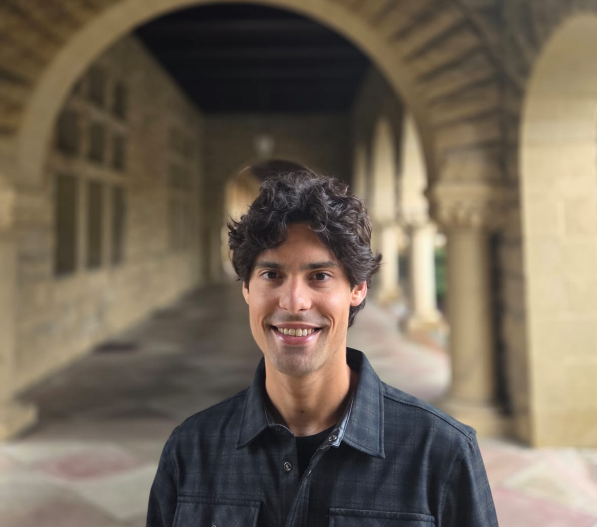

<link rel="stylesheet" href="https://use.fontawesome.com/releases/v6.4.0/css/all.css" integrity="sha384-hWVjflwFxL6sNzntih27bfxkr27PmbbK/iSvJ+a4+0owXq79v+lsFkW54bOGbiDQ" crossorigin="anonymous">
  
  
About
=====================================

Column {data-width=300}
-------------------------------------

###

  

<p1> 
Joao M. Souto-Maior
</p1> 
<p2> 
 
Postdoctoral Scholar
 
Stanford University
 
<a href="files/Souto-Maior_cv.pdf" target="_blank" class = "a2" >CV</a>
<a href="https://github.com/joaosoutomaior/" target="_blank" class = "a2" ><i class="fa-brands fa-github"></i></a>
<a href="https://scholar.google.com/citations?user=z231epEAAAAJ&hl=pt-BR&oi=ao" target="_blank" class = "a2"><i class="fa-solid fa-graduation-cap"></i></a>

Column {data-width=700}
-------------------------------------

###

Welcome to my website!

I am an educational data scientist who investigates the formation of unequal learning opportunities across multiple stages of the life course and how these disparities might be mitigated. My research centers on two core areas: 

* **within-school inequality:** how organizational decisions contribute to or reduce inequality among students within the same institution?
* **learning across the life course:** how can adult learning and training help individuals navigate a rapidly changing labor market and advance social and economic mobility? 

As a quantitative researcher trained in the growing field of computational social science, I am excited about leveraging new datasets and methodologies --- such as machine learning and agent-based simulations --- to produce rigorous evidence on questions of clear policy concern. 

I am currently a Postdoctoral Scholar (New Map of Life Fellow) at the [Stanford Center on Longevity](https://longevity.stanford.edu/), where I work on a [project](https://learningsociety.io/) led by Professor Mitchell Stevens aimed at reimagining the existing educational infrastructure to more effectively integrate learning opportunities across the life course.

I am originally from São Paulo, Brazil. I hold a Ph.D. in Sociology of Education from the New York University (2023) and a B.A. in Economics from the University of Wisconsin-Madison (2017).  

Please navigate across the pages to learn about my research, teaching, and to access selected resources.

###

<p1>Areas of Research</p1>

&emsp; <i class="fa-solid fa-book" style="font-size: 8pt"></i> education inequality
 
&emsp; <i class="fa-solid fa-book" style="font-size: 8pt"></i> organizations
 
&emsp; <i class="fa-solid fa-book" style="font-size: 8pt"></i> social networks
 
&emsp; <i class="fa-solid fa-book" style="font-size: 8pt"></i> career trajectories
 
&emsp; <i class="fa-solid fa-book" style="font-size: 8pt"></i> life-long learning

###

<p1>Methods</p1>

&emsp; <i class="fa-solid fa-book" style="font-size: 8pt"></i> applied statistics
 
&emsp; <i class="fa-solid fa-book" style="font-size: 8pt"></i> social simulation

###

<p1>Education</p1>

&emsp; <i class="fa-solid fa-graduation-cap" style="font-size: 8pt"></i> Ph.D. Sociology of Education, New York University. 2023.
 
&emsp; <i class="fa-solid fa-graduation-cap" style="font-size: 8pt"></i> B.A. Economics, University of Wisconsin-Madison. 2017.

Research  
=====================================

Column 
-------------------------------------

###

<p1> Peer-reviewed publications </p1>

<titlebox>
<p3>Hoarding without hoarders: opportunity hoarding in the absence of exclusionary behaviors. </p3>
 
<me>Joao Souto-Maior</me>. 2026. *Rationality and Society*. 
 
<left>
<button onclick="readMore1('3')" class="button" >more</button>
<button onclick="location.href='https://journals.sagepub.com/doi/10.1177/10434631261417800'" target="_blank" class = "a2">PDFt</button>
<button onclick="location.href='https://github.com/joaosoutomaior/hoarding-without-hoarders-code'" target="_blank" type = "button" class = "a2">code</button>
</left>
</titlebox>
  

<moredetails>
**Abstract:** This paper seeks to clarify the concept of opportunity hoarding as it applies to Black-White educational inequalities. Two prevailing interpretations stand out: a group-disparity interpretation, which treats opportunity hoarding as any process generating group differences, and an exclusionary-behaviors interpretation, which emphasizes how White actors secure advantages through exclusionary practices. I argue that the former is too broad — remaining vague about the underlying mechanisms — and the latter too narrow, overlooking what I term hoarding without hoarders, i.e., opportunity hoarding that arises even in the absence of exclusionary behaviors. I define opportunity hoarding as the relational processes that generate racial penalties in access to resources, i.e., disparities unexplained by previously formed individual differences. Using an agent-based model of racial disparities in advanced course-taking, this paper shows how network diffusion — under segregation, consolidation of race and socioeconomic status, and temporal constraints — can produce racial penalties even when behaviors are race-neutral. The framework highlights the need for scholars and policymakers to look beyond exclusionary acts in the hoarding of valuable resources.
</moredetails>

<titlebox>
<p3>School racial composition and the emergence of Black-White within-school inequalities: network-based foundations </p3>
 
<me>Joao Souto-Maior</me>. 2025. *The Journal of Mathematical Sociology*.
 
<left>
<button onclick="readMore1('1')" class="button" >more</button>
<button onclick="location.href='https://www.tandfonline.com/doi/full/10.1080/0022250X.2025.2458304?src=exp-la'" target="_blank" class = "a2">PDF</button>
<button onclick="location.href='https://github.com/joaosoutomaior/racial-comp-within-school-inequality-code'" target="_blank" type = "button" class = "a2">code</button>
</left>
</titlebox>
 

<moredetails>
**Abstract:** This article investigates mechanism-based explanations for a well-known macro-level pattern in sociology of education, namely, that Black-White unequal access to advanced coursework is the highest in racially diverse and majority-White schools. The study proposes that school racial composition (defined as the share of Whites) could influence the emergence of Black-White course-taking inequalities through the combination of two factors: (a), the relevance of network-based resources for advanced enrollment; and (b), the known relationship between racial composition and network structure. Through an empirically informed agent-based model, this study provides support for the proposed theoretical pathway and shows that, when combined with empirically representative structural inequalities, this racial composition effect can help explaining the pattern of interest. Possible policy implications are discussed.
</moredetails>

<titlebox>
<p3>A critical appraisal of the evidence on racial disproportionality in special education </p3>
 
Rachel Fish, Kenneth Shores and <me>Joao Souto-Maior</me>. 2025. *Exceptional Children*.
 
<left>
<button onclick="readMore1('4')" class="button" >more</button>
<button onclick="location.href='https://journals.sagepub.com/doi/full/10.1177/00144029251350094'" target="_blank" class = "a2">PDF</button>
</left>
</titlebox>
  

<moredetails>
**Abstract:** The under-representation of Black students in special education relative to White students has been identified by recent research as a key equity consideration. We provide six quantitative critiques of the extant literature that should give pause to researchers and policymakers who have concluded the under-representation in special education for Black students is a robust quantitative result. These six critiques are: (i) use of test scores as controls to create non-equivalent comparison groups, (ii) use of colliders as controls, (iii) overuse of same data exaggerates robustness, (iv) overused data are not accurate samples of special education population, (v) over-reliance on regression adjustment over other matching-type estimators, and (vi) inattention to generalizability and heterogeneity of special education placement differences. We identify specific research questions and potential approaches that are needed before firm conclusions about under-representation in special education can be reached.
</moredetails>

<titlebox>
<p3>Differences in academic preparedness do not fully explain Black-White enrollment disparities in advanced high school coursework </p3>
 
<me>Joao Souto-Maior</me> and Ravi Shroff. 2024. *Sociological Science*.
 
<left>
<button onclick="readMore1('2')" class="button">more</button> 
<button onclick="location.href='https://sociologicalscience.com/articles-v11-6-138/'" target="_blank" type = "button" class = "a2">PDF</button> 
<button onclick="location.href='https://github.com/joaosoutomaior/diff-acad-prep-AP-code'" target="_blank" type = "button" class = "a2">code</button>
</left>
</titlebox>
 

<moredetails>
**Abstract:** Whether racial disparities in enrollment in advanced high school coursework can be attributed to differences in prior academic preparation is a central question in sociological research and education policy. However, previous investigations face methodological limitations, for they compare race-specific enrollment rates of students after adjusting for characteristics only partially related to their academic preparedness for advanced coursework. Informed by a recently-developed statistical technique, we propose and estimate a novel measure of students' academic preparedness and use administrative data from a large, urban, public school system to measure differences in AP mathematics enrollment rates among similarly prepared students of different races. We find that preexisting differences in academic preparation do not fully explain the under-representation of Black students relative to White students in AP mathematics. Our results imply that achieving equal opportunities for AP enrollment not only requires equalizing earlier academic experiences, but also addressing inequities that emerge from coursework placement processes.
</moredetails>

###

<p1> Papers under review </p1>

<titlebox>
<p3>IDEA-aligned estimates of racial disproportionality in special education versus conventional approaches: a cautionary note on included-variable bias when achievement and socioeconomic status proxy for special education need </p3>
 
<me>Joao Souto-Maior</me>, Kenneth Shores and Rachel Fish. 
 
<left>
<button onclick="readMore1('5')" class="button" >more</button>
<button onclick="location.href='https://edworkingpapers.com/sites/default/files/ai26-1407.pdf'" target="_blank" class = "a2">preprint</button>
</left>
</titlebox>
  

<moredetails>
**Abstract:** Racial disproportionality in special education is a contested policy space. Federal oversight has traditionally focused on minority over-representation through IDEA’s significant disproportionality framework. However, observational studies report that Black students appear under-identified based on a canonical model that regresses special education receipt on race and controls, notably prior achievement and socioeconomic status (SES). Drawing on this evidence, recent federal proposals would scale back oversight tied to significant disproportionality determinations. We formalize an IDEA-aligned estimand and show analytically that the canonical model recovers it only under strong assumptions. Most notably, it requires that the residual Black--White achievement gap net of SES reflects a gap in disability-related need rather than residual differences in opportunity to learn and other exclusionary factors. In simulations calibrated to empirically plausible environments, the canonical model overstates Black under-representation to an extent sufficient to fully account for previously reported levels. This bias stems from over-controlling for components of social inequality IDEA regards as distinct from disability. We further show popular sensitivity analyses perform poorly in addressing this issue. The implication is that negative coefficients from standard adjustments should not be interpreted as evidence of IDEA-aligned under-service without designs that better separate disability from opportunity. 
</moredetails>

Teaching 
=====================================

Column 
-------------------------------------

### 

<p1>Laboratory instructor</p1>

<titlebox>
<p3>Undergraduate basic statistics</p3>
 
New York University --- from Spring 2019 to Spring 2021
 
<left>
<button onclick="readMore2('6')" class="button"  >more</button> 
<button onclick="location.href='https://bookdown.org/joao_msoutomaior/intro-stats-notes'" target="_blank" class="a2">notes</button> 
<button onclick="location.href='files/syllabus_Basic-Stats_Spring2021.pdf'" target="_blank" class="a2">syllabus S-21</button> 
</left>
</titlebox>
 

<moredetails>
This introductory course is designed to prepare undergraduate &
master’s level students to use statistics for data analysis. This course covers descriptive and
inferential statistics; including frequency distributions, graphs, measures of central tendency,
measures of variability, sampling, probability, z-score, the normal distribution, and tests of
hypothesis such as t-tests, ANOVA, linear correlation and regression, and chi-squared analysis.
Effect size, study designs (observational and experimental) and research concepts (association
and causation; confounding and interaction) will also be addressed. The IBM-SPSS software will
be used for data analysis.
</moredetails>

Column 
-------------------------------------

### 

<p1>Teaching assistant</p1>

<titlebox>
<p3>Introduction to US education: historical and contemporary perspectives</p3>
 
New York University --- Fall 2022
 
<left>
<button onclick="readMore2('3')" class="button"  >more</button>
<button onclick="location.href='files/syllabus_US-Ed_Fall-2022.pdf'" target="_blank" class="a2">syllabus F-22</button>
</left>
</titlebox>
 

<moredetails>
Throughout the semester we will look at a number of important issues in contemporary US schooling
through the lens of history. How have these issues developed over the last three hundred years? What has changed? Who have the prime change agents been? We will also discuss all of these issues as they are in schools today. What is happening now? What should happen? What are the forces for change—for the better or for worse?
 
 
For those who are preparing for careers in teaching, or for students who are interested in education as a field of study (who may want to be journalists or researchers or activists in the field), this course should provide important background historical context. For students of history or politics or who bring a general interest to the questions of this course, Introduction to U.S. Education is designed to help us understand current political, pedagogical, and economic debates.
</moredetails>

<titlebox>
<p3>Political economy of education: why does college cost so much?</p3>
 
New York University --- Fall 2022
 
<left>
<button onclick="readMore2('4')" class="button"  >more</button>
<button onclick="location.href='files/syllabus_College-Costs_Fall-2022.pdf'" target="_blank" class="a2">syllabus F-22</button>
</left>
</titlebox>
 

<moredetails>
College in the United States is expensive, really expensive. For 2022-23, a 120 credit undergraduate degree costs at least $200,000 at many private elite universities (like NYU) – plus all sorts of miscellaneous fees, lodging and food charges, books and more. Why does it cost so much? Is it a good deal? Why do so many high school students apply to study at such expensive institutions when there are cheaper alternatives available? Who is able to attend, and who is excluded? Why do college costs keep rising so fast? Shouldn’t college be free? The purpose of this course is to provide answers to these kinds of questions. It will introduce students to a range of economic concepts and empirical evidence that speaks to: the value of higher education for individuals and for societies; federal, state, and institutional financial aid policies; university budgets and spending priorities. We will consider individual student, institutional and societal perspectives.
</moredetails>

<titlebox>
<p3>Qualitative methods in international education</p3>
 
New York University --- Spring 2022
 
<left>
<button onclick="readMore2('5')" class="button"  >more</button>
<button onclick="location.href='files/syllabus_Qual-Methods_Spring2022.pdf'" target="_blank" class="a2">syllabus S-22</button>
</left>
</titlebox>
 

<moredetails>
This course provides an introduction to qualitative methods that scholars and practitioners use in
international and comparative education and the social sciences more broadly. It is intended to
provide an overview of research design, data collection, and data analysis and presentation most
commonly associated with qualitative research. 
</moredetails>

Column 
-------------------------------------

###

<p1>Seminar leader</p1>

<titlebox>
<p3>URS seminar: research, creative work and the public good</p3>
 
University of Wisconsin-Madison --- 2016-17
 
<left>
<button onclick="readMore2('2')" class="button"  >more</button>
<button onclick="location.href='files/syllabus_URS_Fall2016.pdf'" target="_blank" class="a2">syllabus F-16</button> 
<button onclick="location.href='files/syllabus_URS_Spring2017.pdf'" target="_blank" class="a2">syllabus S-17</button>
</left>
</titlebox>
 

<moredetails>
The course is designed to introduce students to the practice of research and creative work, and
its implications for society. The course has two components: the work you do as an assistant on
faculty projects, and your participation in the small group seminar. In the school year 2016-17, the
seminar is dedicated to the theme: research, creative work and the public good. We will spend
the year critically exploring this theme across different disciplines, and touching on a range of
societal problems. The theme is to provoke reflection in our research or creative work experiences, and in the
different parts of the world we inhabit. Come prepared to share your thinking on the topics
introduced. Through discussions, activities and assignments you may learn as much from one
another as you learn through your research project.
</moredetails>

<titlebox>
<p3>URS seminar: research and creative work at the boundaries</p3>
 
University of Wisconsin-Madison --- 2015-16
 
<left>
<button onclick="readMore2('1')" class="button"  >more</button>
<button onclick="location.href='files/syllabus_URS_Fall2015.pdf'" target="_blank" class="a2">syllabus F-15</button> 
<button onclick="location.href='files/syllabus_URS_Spring2016.pdf'" target="_blank" class="a2">syllabus S-16</button>
</left>
</titlebox>
 

<moredetails>
The course is designed to introduce students to the practice of research and creative work,
and its implications for society. The course has two components: the work you do as an
assistant on faculty projects, and your participation in the small group seminar. In the school
year 2015-16, the seminar is dedicated to the theme: research and creative work at the
 boundaries. We will spend the year critically exploring this theme across different disciplines,
and touching on a range of societal problems. The theme is to provoke reflection in our research or creative work experiences, and in the different parts of the world we inhabit. Come prepared to share your thinking on the topics
introduced. Through discussions, activities and assignments you may learn as much from one
another as you learn through your research project.
</moredetails>

Resources 
=====================================

Column 
-------------------------------------

###

<p1>PhD study</p1>

<titlebox>
<p3>Dissertation</p3>
 
Essays on the dynamics of Black-White advanced course-taking inequalities 
 
<left>
<button onclick="readMore3('1')" class="button"  >more</button>
</left>
</titlebox>
 

<moredetails>
The purpose of the project is to identify and explore the dynamics of the mechanisms generating Black-White advanced course-taking inequalities within schools. The project constructs a series of qualitatively-informed agent-based models which and explore the conditions which foster/hinder the emergence of these inequalities. Models are empirically calibrated and validated according to national data from American schools.
 
 
**Committee members**
 
- L’Heureux Lewis-McCoy (Chair)
 
- Samuel Lucas
 
- Erez Hatna
 
- Ravi Shroff
 
</moredetails>

<titlebox>
<p3>Coursework</p3>
 
Areas of concentration: school organization; quantitative methods.
 
<left>
<button onclick="readMore3('2')" class="button"  >more</button>
<button onclick="location.href='files/JSM_PhD-coursework.pdf'" target="_blank" class="a2">course list</button> 
</left>
</titlebox>
 

<moredetails>
Chosen courses result from the required courses for program completion and elective courses chosen together with the PhD advisor.
</moredetails>

<titlebox>
<p3>Comprehensive oral exam</p3>
 
<left>
<button onclick="readMore3('3')" class="button"  >more</button>
<button onclick="location.href='files/JSM_comps-list.pdf'" target="_blank" class="a2">reading list</button> 
</left>
</titlebox>
 

<moredetails>
The doctoral comprehensive examination in the Sociology of Education program is intended for students to achieve and demonstrate a comprehensive working knowledge of a large subfield of sociology. We trust that the knowledge facilitated by the exam will serve our students well as they write their dissertations and continue into subsequent stages of their careers. The exam consists of an oral examination in two areas: (1) a list of 18 books and articles that our program considers to be foundational to the field of Sociology of Education and (2) approximately 32 additional readings (for a total of approximately 50 readings on the comps list), both theoretical and empirical, in an area of the student’s specialization.
</moredetails>

<titlebox>
<p3>Independent study: Black-White within-school achievement gaps</p3>
 
<left>
<button onclick="readMore3('4')" class="button"  >more</button>
<button onclick="location.href='files/JSM_within-school-gaps-course.pdf'" target="_blank" class="a2">reading list</button>
</left>
</titlebox>
 

<moredetails>
In this independent study, my goal was to review some of the key explanations for within-school achievement gaps in the sociology of education literature. I am particularly interested in texts discussing how school contexts and school characteristics contribute to or mitigate the production of academic inequality within schools. My literature review focuses on four key themes: (1) peer networks, (2) student course taking, (3) teacher expectations and (4) parental influence.
</moredetails>

Column 
-------------------------------------

###

<p1>Tools for interactive visualizations</p1>

<titlebox>
<p3>A dashboard of inequality in Sao Paulo high schools</p3>
 
<left>
<button onclick="readMore4('5')" class="button"  >more</button>
<button onclick="location.href='https://joaomsoutomaior.shinyapps.io/SaoPaulo_HighSchools_ENEM2019/'" target="_blank" class = "a2">dashboard</button>
</left>
</titlebox>
 

Column 
-------------------------------------

###

<p1>New books network (NBN) podcast</p1>

<titlebox>
<p3>Host of new books in education</p3>
 
<left>
<button onclick="readMore4('6')" class="button"  >more</button>
<button onclick="location.href='https://newbooksnetwork.com/hosts/profile/8b8ec5a3-bdb5-43ca-ada6-3fc2f82f9af5'" target="_blank" class="a2">my episodes</button> 
</left>
</titlebox>
 

<moredetails>
The [New Books Network](https://newbooksnetwork.com/) is the largest book podcast network in the world, reaching hundreds of thousands of listeners a month and with listeners downloading well over a million NBN episodes each month. The purpose of NBN interviews is to allow authors to tell the audience what they found in their research and what they wrote in their books. It is a wonderful idea, connecting authors with a large audience worldwide, and advancing the broad goal of public education.
</moredetails>

