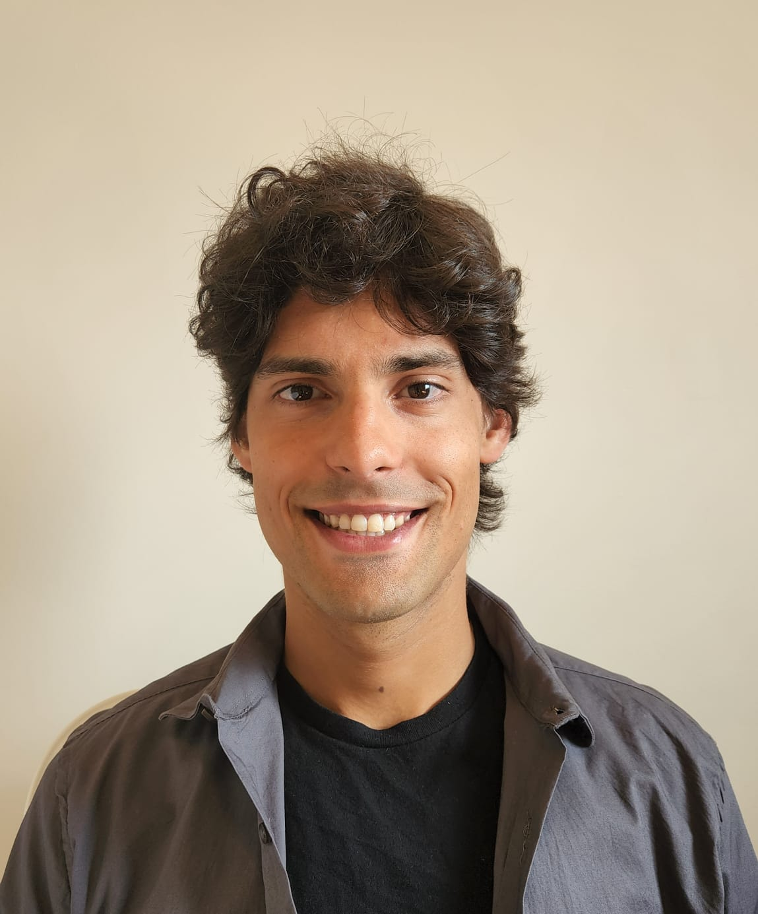

Column {data-width=400}
-------------------------------------

### 

<p2> 
 
**PhD Candidate, Sociology of Education**
 
New York University
 
 
**Research interests** 
 
School organization; Within-school racial and socioeconomic inequalities; Student sorting processes; Social interactions; Agent-based-modeling; Computational social science.
</p2> 
 
 
<left>
<a href="files/JSM_cv_public-version.pdf" target="_blank" class = "a3" >CV</a>
  <a href="https://github.com/joaosoutomaior/" target="_blank" class = "a2" >GITHUB</a>
  <a href="https://steinhardt.nyu.edu/joao-pedro-m-souto-maior" target="_blank" class = "a2" >NYU PAGE</a>
</left>

### About

I am a fifth-year Ph.D. student in [Sociology of Education](https://steinhardt.nyu.edu/programs/sociology-education) in the [Department of Applied Statistics, Social Science and Humanities](https://steinhardt.nyu.edu/departments/applied-statistics-social-science-and-humanities) at [New York University's Steinhardt School of Culture, Education and Human Development](https://steinhardt.nyu.edu/). I am on the 2022-23 job market.

I am interested in understanding how the organization of schools influences the learning experiences of students and how it shapes the emergence of within-school educational inequalities along dimensions of race and class. My research applies rigorous computational methods---ranging from qualitatively-informed agent-based models to machine-learning approaches---in innovative and creative ways to the study of school organization, providing valuable policy insights on how to better structure schools to ensure the provision of equal educational opportunities for students from all backgrounds. Broadly, this work fits within the sub-fields of Sociology of Education, Computational Social Sciences and Analytical Sociology.

I am originally from São Paulo, Brazil. I received my BA in economics from the [University of Wisconsin-Madison](https://econ.wisc.edu/) in 2017. After my undergraduate studies, I started as an economics doctoral student at [The Graduate Center of the City University of New York](https://www.gc.cuny.edu/economics), where I studied for a year before transferring to NYU.

*A note on names:* for publication purposes, I use a hyphenated version of my last name: João M. Souto-Maior

Column {data-width=600} {.tabset}
-------------------------------------

### Research 

<subheading>Manuscripts under review</subheading>

<pbox>
<phead>
<up>Explaining the link between school racial composition and Black-White
within-school inequalities: two interaction-based mechanisms</up>
 
<p1>Joao Souto-Maior.</p1> *Submitted: Fall 2022 (job market paper)* 
 
<left style="float: left">
<button onclick="readMore1('1')" class="button" style="float: left">DETAILS</button>
</left>
</phead>
 

<pmain>
**Previous title:** Black-White advanced enrollment inequalities and the share of White students in school: an agent-based modeling investigation
 
**Abstract:** This article investigates mechanism-based explanations for a puzzling finding in education research, namely, that Black-White unequal access to school resources---defined as advanced coursework---is the highest in racially integrated settings. Because the advanced enrollment process depends on different interaction-based processes, this study hypothesizes that the known relationship between relative group size and racial homophily provides a possible explanatory path. Through the construction and analysis of a qualitatively informed, empirically calibrated and validated agent-based model of the advanced enrollment processes, this study highlights two mechanisms that contribute to this puzzling link. First, the diffusion of parental information resources within students' and parents' networks. Second, the diffusion of beliefs about social and academic belonging in advanced courses within students' networks. By examining the model features shaping the dynamics of these mechanisms, the study also sheds light into policy strategies to improve Black students' access to school resources in racially integrated settings. 
</pmain>
</pbox>

<pbox>
<phead>
<up>Differences in academic preparedness do not fully explain Black-White enrollment disparities in advanced high school coursework </up>
 
<p1>Joao Souto-Maior</p1> & Ravi Shroff. *Submitted: Fall 2022*
 
<left style="float: left">
<button onclick="readMore1('2')" class="button" style="float: left">DETAILS</button>
</left>
</phead>
 

<pmain>
**Abstract:** Whether US high school Advanced Placement enrollment processes favor some race groups over others is a central empirical question in educational research and policy.However, previous investigations face  methodological limitations, for they compare enrollment rates of students after adjusting for characteristics only partially related to academic preparedness for advanced coursework. Informed by a recently-developed statistical technique, we propose and estimate a novel measure of students' academic preparedness and use administrative data from a large, urban, public school system to measure ``preparedness-adjusted" Black-White disparities in AP mathematics enrollment, i.e., differences in enrollment rates among similarly prepared students of different races. We find that preexisting differences in academic preparation do not fully explain the under-representation of Black students relative to White students in AP mathematics. Our results imply that achieving equal opportunities for AP enrollment not only require equalizing earlier academic experiences, but also addressing inequities that emerge from coursework placement processes.
</pmain>
</pbox>

<subheading>Manuscripts in preparation</subheading>

<pbox>
<phead>
<up>Hoarding without hoarders: collateral effects of information diffusion on within-school racial inequalities</up>
 
<p1>Joao Souto-Maior.</p1> *Expected submission: Fall 2022*
 
<left style="float: left">
<button onclick="readMore1('3')" class="button" style="float: left">DETAILS</button>
</left>
</phead>
  

<pmain>
I examine the necessary conditions under which parental information diffusion shapes Black-White unequal access to advanced course-taking, highlighting a non-intuitive result that individual-level hoarding of resources within race groups is not necessary for racial inequalities to emerge. 
</pmain>
</pbox>

<pbox>
<phead>
<up>The salience of mechanisms shaping within-school racial inequalities across school- and district-level characteristics</up>
 
<p1>Joao Souto-Maior.</p1> *Expected submission: Summer 2023*
 
<left style="float: left">
<button onclick="readMore1('4')" class="button" style="float: left">DETAILS</button>
</left>
</phead>
  

<pmain>
I explore the school- and district-level characteristics under which the agent-based model constructed in "Black-White advanced enrollment inequalities and the share of White students in school: an agent-based modeling investigation" performs best, providing insights on circumstances under which the inequality-producing mechanisms considered in the model tend to be more salient.
</pmain>
</pbox>

<pbox>
<phead>
<up>Determinants of race- and class-based educational inequalities within Brazilian high schools</up>
 
<p1>Joao Souto-Maior.</p1> *Expected submission: Fall 2022*
 
<left style="float: left">
<button onclick="readMore1('5')" class="button" style="float: left">DETAILS</button>
<a href="https://joaomsoutomaior.shinyapps.io/SaoPaulo_HighSchools_ENEM2019/" target="_blank" class = "a2">DASHBOARD</a>
</left>
</phead>
  

<pmain>
This paper aims at filling the gap of descriptive investigations of within-school educational inequalities in Brazil. Using publicly-available data from national high school exams, I rely on multilevel-models of student performance with school- and race-specific random effects to highlight the school-level factors correlated with within-school inequalities. An ultimate goal of the project is to allow its academic findings to be accessible to the general public---journalists, policymakers and those who wish to invest in better conditions for learning in Brazilian schools. A final product of this work is the publishing of an accessible and interactive dashboard application, which maps race- and class-based within-school inequalities across Brazilian schools, allowing users to gain both a broad and school-specific view of the study's results.
</pmain>
</pbox>

<pbox>
<phead>
<up>Stepping out of the closet and into engagement: a quantitative analysis of outness, GSA engagement, and classroom engagement</up>
 
Hank Sherwood, <p1>Joao Souto-Maior</p1>, Paul Poteat, Hirokazu Yoshikawa, Jerel Calzo. *Expected submission: Fall 2022* 
 
<left style="float: left">
<button onclick="readMore1('6')" class="button" style="float: left">DETAILS</button> <a href="https://github.com/joaosoutomaior/outness-engagement-GSAs-code" class = "a2" >CODE</a>
</left>
</phead>
 

<pmain>
Using survey data from Massachusetts, New York paper, and San Diego schools, the project examines the role of gender and sexual outness on student classroom engagement. As a second author, my primary contribution to this project consists of providing a methodological assistance and of developing the code for the data analysis.
</pmain>
</pbox>

<subheading>Conference presentations</subheading>

<pbox>
<phead>
<up>Black-White advanced enrollment inequalities and the racial composition of schools: an agent-based modeling investigation</up>
 
<p1>Joao Souto-Maior.</p1> *American Sociological Association: Session on Mathematical and Computational Approaches to Studying Inequality*. 2022
</phead>
</pbox>

<pbox>
<phead>
<up>Black-White advanced enrollment inequalities and the racial composition of schools: an agent-based modeling investigation</up>
 
<p1>Joao Souto-Maior.</p1> *The Seventh Joint US-Japan Conference on Mathematical Sociology and Rational Choice*. 2022.
</phead>
</pbox>

<subheading>Other presentations</subheading>

<pbox>
<phead>
<up>Opportunity hoarding and Black-White inequalities in advanced enrollment: a simulation-based approach</up>
 
<p1>Joao Souto-Maior.</p1> *Race and Ethnicity Workshop, New York University's Department of Sociology.* 2021.
</phead>
</pbox>

### Teaching 

<subheading>Laboratory instructor</subheading>

<pbox>
<phead>
<up>Undergraduate Basic Statistics</up>
 
New York University --- from Spring 2019 to Spring 2021
 
<left style="float: left">
<button onclick="readMore2('1')" class="button" style="float: left" style="float: right">DETAILS</button> <a href="https://bookdown.org/joao_msoutomaior/intro-stats-notes" target="_blank" class="a2">NOTES</a> <a href="files/syllabus_Basic-Stats_Spring2021.pdf" target="_blank" class="a3">SPRING 21</a> 
</left>
</phead>
 

<pmain>
This introductory course is designed to prepare undergraduate &
master’s level students to use statistics for data analysis. This course covers descriptive and
inferential statistics; including frequency distributions, graphs, measures of central tendency,
measures of variability, sampling, probability, z-score, the normal distribution, and tests of
hypothesis such as t-tests, ANOVA, linear correlation and regression, and chi-squared analysis.
Effect size, study designs (observational and experimental) and research concepts (association
and causation; confounding and interaction) will also be addressed. The IBM-SPSS software will
be used for data analysis.
</pmain>
</pbox>

<subheading>Teaching assistant</subheading>

<pbox>
<phead>
<up>Introduction to US Education: Historical and Contemporary Perspectives</up>
 
New York University --- Fall 2022
 
<left style="float: left">
<button onclick="readMore2('4')" class="button" style="float: left" style="float: right">DETAILS</button>
<a href=" " target="_blank" class="a3">FALL 22</a>
</left>
</phead>
 

<pmain>
Throughout the semester we will look at a number of important issues in contemporary US schooling
through the lens of history. How have these issues developed over the last three hundred years? What has changed? Who have the prime change agents been? We will also discuss all of these issues as they are in schools today. What is happening now? What should happen? What are the forces for change—for the better or for worse?
 
 
For those who are preparing for careers in teaching, or for students who are interested in education as a field of study (who may want to be journalists or researchers or activists in the field), this course should provide important background historical context. For students of history or politics or who bring a general interest to the questions of this course, Introduction to U.S. Education is designed to help us understand current political, pedagogical, and economic debates.
</pmain>
</pbox>

<pbox>
<phead>
<up>Political Economy of Education: Why Does College Cost So Much?</up>
 
New York University --- Fall 2022
 
<left style="float: left">
<button onclick="readMore2('3')" class="button" style="float: left" style="float: right">DETAILS</button>
<a href=" " target="_blank" class="a3">FALL 22</a>
</left>
</phead>
 

<pmain>
College in the United States is expensive, really expensive. For 2022-23, a 120 credit undergraduate degree costs at least $200,000 at many private elite universities (like NYU) – plus all sorts of miscellaneous fees, lodging and food charges, books and more. Why does it cost so much? Is it a good deal? Why do so many high school students apply to study at such expensive institutions when there are cheaper alternatives available? Who is able to attend, and who is excluded? Why do college costs keep rising so fast? Shouldn’t college be free? The purpose of this course is to provide answers to these kinds of questions. It will introduce students to a range of economic concepts and empirical evidence that speaks to: the value of higher education for individuals and for societies; federal, state, and institutional financial aid policies; university budgets and spending priorities. We will consider individual student, institutional and societal perspectives.
</pmain>
</pbox>

<pbox>
<phead>
<up>Qualitative Methods in International Education</up>
 
New York University --- Spring 2022
 
<left style="float: left">
<button onclick="readMore2('2')" class="button" style="float: left" style="float: right">DETAILS</button>
<a href="files/syllabus_Qual-Methods_Spring2022.pdf" target="_blank" class="a3">SPRING 22</a>
</left>
</phead>
 

<pmain>
This course provides an introduction to qualitative methods that scholars and practitioners use in
international and comparative education and the social sciences more broadly. It is intended to
provide an overview of research design, data collection, and data analysis and presentation most
commonly associated with qualitative research. 
</pmain>
</pbox>

<subheading>Seminar leader</subheading>

<pbox>
<phead>
<up>URS Seminar: Research, Creative Work and the Public Good</up>
 
University of Wisconsin-Madison --- 2016-17
 
<left style="float: left">
<button onclick="readMore2('3')" class="button" style="float: left" style="float: right">DETAILS</button>
<a href="files/syllabus_URS_Fall2016.pdf" target="_blank" class="a3">FALL 2016</a> 
<a href="files/syllabus_URS_Spring2017.pdf" target="_blank" class="a3">SPRING 17</a>
</left>
</phead>
 

<pmain>
The course is designed to introduce students to the practice of research and creative work, and
its implications for society. The course has two components: the work you do as an assistant on
faculty projects, and your participation in the small group seminar. In the school year 2016-17, the
seminar is dedicated to the theme: research, creative work and the public good. We will spend
the year critically exploring this theme across different disciplines, and touching on a range of
societal problems. The theme is to provoke reflection in our research or creative work experiences, and in the
different parts of the world we inhabit. Come prepared to share your thinking on the topics
introduced. Through discussions, activities and assignments you may learn as much from one
another as you learn through your research project.
</pmain>
</pbox>

<pbox>
<phead>
<up>URS Seminar: Research and Creative Work at the Boundaries</up>
 
University of Wisconsin-Madison --- 2015-16
 
<left style="float: left">
<button onclick="readMore2('4')" class="button" style="float: left" style="float: right">DETAILS</button>
<a href="files/syllabus_URS_Fall2015.pdf" target="_blank" class="a3">FALL 15</a> 
<a href="files/syllabus_URS_Spring2016.pdf" target="_blank" class="a3">SPRING 16</a>
</left>
</phead>
 

<pmain>
The course is designed to introduce students to the practice of research and creative work,
and its implications for society. The course has two components: the work you do as an
assistant on faculty projects, and your participation in the small group seminar. In the school
year 2015-16, the seminar is dedicated to the theme: research and creative work at the
 boundaries. We will spend the year critically exploring this theme across different disciplines,
and touching on a range of societal problems. The theme is to provoke reflection in our research or creative work experiences, and in the different parts of the world we inhabit. Come prepared to share your thinking on the topics
introduced. Through discussions, activities and assignments you may learn as much from one
another as you learn through your research project.
</pmain>
</pbox>

### PhD study

<pbox>
<phead>
<up>PhD dissertation</up>
 
Essays on the dynamics of Black-White advanced course-taking inequalities 
 
<left style="float: left">
<button onclick="readMore3('1')" class="button" style="float: left" style="float: right">DETAILS</button>
</left>
</phead>
 

<pmain>
The purpose of the project is to identify and explore the dynamics of the mechanisms generating Black-White advanced course-taking inequalities within schools. The project constructs a series of qualitatively-informed agent-based models which and explore the conditions which foster/hinder the emergence of these inequalities. Models are empirically calibrated and validated according to national data from American schools.
 
 
**Committee members**
 
- L’Heureux Lewis-McCoy (Chair)
 
- Samuel Lucas
 
- Erez Hatna
 
- Ravi Shroff
 
</pmain>
</pbox>

<pbox>
<phead>
<up>PhD coursework</up>
 
Areas of concentration: School organization; Quantitative methods
 
<left style="float: left">
<button onclick="readMore3('2')" class="button" style="float: left" style="float: right">DETAILS</button>
<a href="files/JSM_PhD-coursework.pdf" target="_blank" class="a3">COURSE LIST</a> 
</left>
</phead>
 

<pmain>
Chosen courses result from the required courses for program completion and elective courses chosen together with the PhD advisor.
</pmain>
</pbox>

<pbox>
<phead>
<up>Comprehensive oral exam</up>
 
<left style="float: left">
<button onclick="readMore3('3')" class="button" style="float: left" style="float: right">DETAILS</button>
<a href="files/JSM_comps-list.pdf" target="_blank" class="a3">READING LIST</a> 
</left>
</phead>
 

<pmain>
The doctoral comprehensive examination in the Sociology of Education program is intended for students to achieve and demonstrate a comprehensive working knowledge of a large subfield of sociology. We trust that the knowledge facilitated by the exam will serve our students well as they write their dissertations and continue into subsequent stages of their careers. The exam consists of an oral examination in two areas: (1) a list of 18 books and articles that our program considers to be foundational to the field of Sociology of Education and (2) approximately 32 additional readings (for a total of approximately 50 readings on the comps list), both theoretical and empirical, in an area of the student’s specialization.
</pmain>
</pbox>

<pbox>
<phead>
<up>Independent study: Black-White within-school achievement gaps</up>
 
<left style="float: left">
<button onclick="readMore3('4')" class="button" style="float: left" style="float: right">DETAILS</button>
<a href="files/JSM_within-school-gaps-course.pdf" target="_blank" class="a3">READING LIST</a>
</left>
</phead>
 

<pmain>
In this independent study, my goal was to review some of the key explanations for within-school achievement gaps in the sociology of education literature. I am particularly interested in texts discussing how school contexts and school characteristics contribute to or mitigate the production of academic inequality within schools. My literature review focuses on four key themes: (1) peer networks, (2) student course taking, (3) teacher expectations and (4) parental influence.
</pmain>
</pbox>

### Other academic involvement 

<pbox>
<phead>
<up>Host of New Books in Education</up>
 
A podcast channel of the New Books Network (NBN) 
 
<left style="float: left">
<button onclick="readMore4('1')" class="button" style="float: left" style="float: right">DETAILS</button>
<a href="https://newbooksnetwork.com/hosts/profile/8b8ec5a3-bdb5-43ca-ada6-3fc2f82f9af5" target="_blank" class="a2">MY EPISODES</a> 
</left>
</phead>
 

<pmain>
The [New Books Network](https://newbooksnetwork.com/) is the largest book podcast network in the world, reaching hundreds of thousands of listeners a month and with listeners downloading well over a million NBN episodes each month. The purpose of NBN interviews is to allow authors to tell the audience what they found in their research and what they wrote in their books. It is a wonderful idea, connecting authors with a large audience worldwide, and advancing the broad goal of public education.
</pmain>
</pbox>

